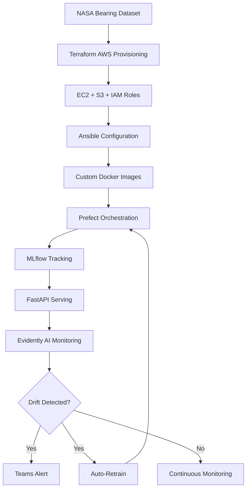

# Predictive Maintenance MLOps Pipeline


---

## Overview

This repository implements a **production-grade MLOps pipeline** for **predictive maintenance of rotating machinery (bearings)**, using the [NASA Bearing Dataset].
---

## Problem Statement

Industrial equipment failures, such as bearing breakdowns, lead to:
- Expensive **unplanned downtime**
- Higher **maintenance expenses**
- Significant **safety risks**

Traditional time-based maintenance schedules waste resources and fail to prevent unexpected failures.

**Goal:**  
Predict failures **before they happen** by:
1. Analyzing vibration and sensor time-series data.
2. Building ML models to predict Remaining Useful Life (RUL) or failure probability.
3. Detecting **data drift** and **performance degradation** automatically.
4. Triggering **retraining and alerts** when model reliability drops.

---
##  Solution Architecture



---
 Repository Structure
```bash
├── .gitignore
├── Jenkinsfile
├── Makefile
├── README.md
├── Terraform
│   ├── backends.tf
│   ├── ec2.tf
│   ├── iam.tf
│   ├── main.tf
│   ├── outputs.tf
│   ├── providers.tf
│   ├── s3.tf
│   ├── state
│   │   ├── terraform.tfstate
│   │   └── terraform.tfstate.backup
│   └── variables.tf
├── ansible
│   ├── inventory
│   │   └── hosts.ini
│   ├── jenkins
│   │   ├── Dockerfile
│   │   ├── docker-compose-jenkins.yml
│   │   ├── dockerpermissions.yml
│   │   └── jenkins.yml
│   ├── mlflow
│   │   ├── docker-compose-mlflow.yml
│   │   └── mlflow.yml
│   └── prefect
│       ├── docker-compose-prefect.yml
│       ├── prefect.yml
│       ├── start-agent.sh
│       └── start-agent.sh:Zone.Identifier
├── data
│   ├── drifted
│   │   └── 1st_test
│   ├── processed
│   │   └── features.csv
│   └── raw
│       └── Nasa-Bearing
│           ├── 1st_test
│           ├── 2st_test
│           ├── 3rd_test
│           └── Readme Document for IMS Bearing Data.pdf
├── full_pipeline-deployment.yaml
├── mlruns
├── notebooks
│   ├── .ipynb_checkpoints
│   │   └── eda_features-checkpoint.ipynb
│   └── eda_features.ipynb
├── prefect
│   ├── Dockerfile
│   ├── docker-compose.yml
│   ├── monitor_pipeline-deployment.yaml
│   └── start-agent.sh
├── setup.py
└── src
    ├── deployment-pipeline.py
    ├── extract_features.py
    ├── full_pipeline-deployment.yaml
    ├── monitoring
    │   ├── alert.py
    │   ├── drift_check.py
    │   ├── prefect_monitor_flow.py
    │   ├── simulate_drifting.py
    │   └── workflow_trigger.py
    ├── serving
    │   ├── app.py
    │   └── input_example.json
    └── train.py
```
##  Key Features

###  Infrastructure Automation
- **Terraform-provisioned EC2 on AWS** with Elastic IP  
- **S3 bucket** for data/model storage  
- **IAM roles** for secure S3 access  
- **Security groups** with least-privilege ports  

###  Custom Docker Images
- `prefect-agent-custom`: Pre-loaded with Python 3.10 + dependencies  
- `jenkins`: Handle permissions to use separate docker containers as agents for CI/CD pipelines  

###  ML Lifecycle Management
- **workflow orchestration** using prefect
- **Model versioning** in MLflow Registry  
- **Automated retraining triggers**  
- **Data drift detection** with Evidently AI  

###  CI/CD & Monitoring
- **Jenkins pipelines** for deployment and training
- **Microsoft Teams alert** integration  
- **Prefect dashboard** for workflow monitoring
- 
###  FastAPI Model Serving

**Minimal production API** that auto-serves the latest production model from MLflow registry 

## Quickstart

### 1. Clone the Repository
```bash
git clone https://github.com/norahosny66/predictive-maintenance-mlops.git
cd predictive-maintenance-mlops
```
### 2.  Provision Infrastructure (Terraform)
```bash
cd terraform/
terraform init
terraform plan 
terraform apply
```
This will create:

EC2 instance with IAM Role

S3 bucket for model/data storage

Security groups with necessary ports open
### 3. Update Inventory for Ansible

```bash
cd ../ansible/
echo -e "[mlops]\n<your-ec2-public-ip>" > inventory.yml
```
### 4.  Configure EC2 (Ansible)
```bash
ansible-playbook -i inventory.yml mlflow.yml
ansible-playbook -i inventory.yml prefect.yml
ansible-playbook -i inventory.yml jenkins.yml
```
### 5.  Upload Data to S3

### 6. Register & Run Prefect Flow
Build and apply Prefect deployment:
```bash
prefect deployment build pipeline.py:train_and_monitor -n "prod-flow"
prefect deployment apply train_and_monitor-deployment.yaml
prefect agent start
```
And do the same for monitoring pipeline
# MLflow tracking server

Access UIs:

Prefect → http://<EC2_IP>:4200

MLflow → http://<EC2_IP>:5050

Jenkins → http://<EC2_IP>:8080


### Simulate Drift Detection & Retrain
```bash
docker exec -it prefect-prefect-agent-1  bash
prefect deployment apply prefect/monitor_pipeline-deployment.yaml
```
This will:

Detect drift (via Evidently AI)

Trigger retraining

##  Teams Alert Configuration

1. **Create an incoming webhook** in your Microsoft Teams channel  
   - Go to your channel → **Connectors** → **Incoming Webhook** → Generate URL

2. **Update `src/alert.py`** with your webhook URL:

   ```python
   WEBHOOK_URL = "https://..."
   
## FastAPI Model Serving
```bash
uvicorn api:app --reload  # Dev
gunicorn -w 4 -k uvicorn.workers.UvicornWorker api:app  # Prod
```
Access: http://localhost:8000/docs


