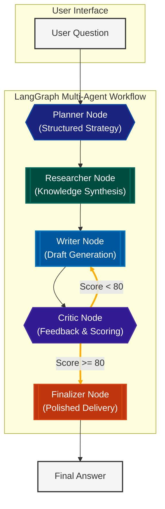

# Agentic RAG App: Multi-Agent Research & Writing Pipeline

> **Empowering autonomous research through a collaborative multi-agent architecture built on LangGraph.**

This project implements an advanced **Agentic RAG (Retrieval-Augmented Generation)** pipeline. Unlike traditional RAG systems that follow a linear path, this application utilizes a choreography of specialized agents—Planner, Researcher, Writer, and Critic—to iteratively research, draft, and refine high-quality content.

---

##  Architecture & Flow

The system operates as a stateful graph where each node represents an agent. The flow is cyclical, allowing the system to learn from its own drafts through a feedback loop.

